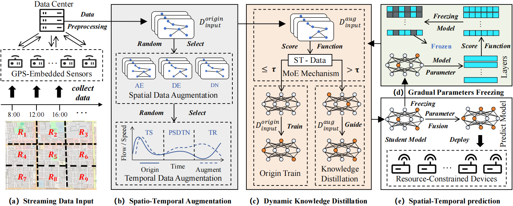

# Storm
This is a PyTorch implementation of the paper: Towards Online Spatio-Temporal Data Prediction: A Knowledge Distillation Driven Continual Learning Approach (Storm)




## Requirements & Configuration
The model is implemented using Python3 with dependencies specified in requirements.txt, and configuration.txt indicates the conda version and Python version used.

```
pip install -r requirements.txt
```

## Data Preparation

1. METR-LA ：The METR-LA dataset contains traffic data collected from 207 loop detectors on highways in Los Angeles County. The data spans from March 1, 2012, to June 30, 2012, with a sampling interval of 5 minutes.

2. PEMS-BAY：The PEMS-BAY dataset consists of traffic data collected by 325 sensors in the California Bay Area. The data spans from January 1, 2017, to May 31, 2017, with a sampling interval of 5 minutes.

3. PEMS04： This PEMS04 dataset  includes traffic data from the PeMS system in California's District 4. It covers the period from January 1, 2018, to February 28, 2018, with a sampling interval of 5 minutes, collected from 307 sensors.

4. PEMS08：The PEMS08 dataset comprises traffic data from the PeMS system in California's District 8. The data spans from July 1, 2016, to August 31, 2016, sampled every 5 minutes, and collected from 170 sensors.

[METR-LA & PEMS-BAY]：https://github.com/liyaguang/DCRNN

[PEMSD4 & PEMSD8]：https://github.com/Davidham3/ASTGCN

```

# Create data directories, For example
mkdir -p data/{PEMSD4}

Download PEMSD4 dataset then unzip in PEMSD4

```

## Model Training

* STGCN

```
cd STGCN 

python STGCN_Main.py

```

* AGCRN

```
cd AGCRN 

python AGCRN_Main.py

```

* MTGNN

```
cd MTGNN 

python MTGNN_Main.py

```

* STAEformer

```
cd STAEformer 

python STGCN_Main.py

cd model/

python train.py -d <dataset> -g <gpu_id>
```

## Acknowledgement

Our research code refers to the following works:

[1] STG4Traffic：https://github.com/trainingl/STG4Traffic

[2] STAEformer https://github.com/XDZhelheim/STAEformer

